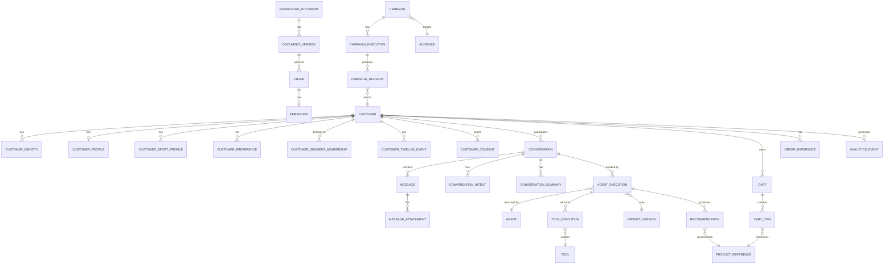

# Domain Model — Polar AI Commerce

Pragmatic DDD: bounded contexts map 1:1 to `packages/*` and to PostgreSQL schemas (`crm`, `conversation`,
`ai`, `commerce`, `knowledge`, `campaign`, `consent`, `analytics`, `security`). Cross-context access happens
through package APIs, never through cross-schema joins from another context's code.

## 1. Core entities and relationships



## 2. Entity responsibilities

| Entity | Context | Responsibility | Notes |
|---|---|---|---|
| `Customer` | CRM | Immutable internal identity anchor | `customer_id` (UUID) is the only PK ever referenced cross-context. Never phone/email. |
| `CustomerIdentity` | CRM | One row per external identifier (WhatsApp ID, phone, email, VTEX customer ID, future IDs) | Many-to-one to `Customer`. Drives identity resolution (§ below). |
| `CustomerProfile` | CRM | Name, birth date, location, general preferences | 1:1 with `Customer`. |
| `CustomerSportProfile` | CRM | Sport, level, frequency, goal, experience, distance, routine | 1:N — a customer can have multiple sport profiles (e.g. running + swimming). |
| `CustomerPreference` | CRM | Attribute/value pairs with `confidence`, `source`, `expires_at` | Never a single free-text memory blob — see § below. |
| `CustomerSegment` / `CustomerTag` | CRM | Segmentation and tagging for campaigns/analytics | Segments can be rule-based (materialized) or static. |
| `CustomerTimeline` | CRM | Append-only unified timeline of everything relationship-relevant | Read model, populated by the event layer. |
| `Conversation` | Conversation | One WhatsApp thread with a customer, with explicit state | State machine — see `system-overview.md` §4 and `ai-architecture.md`. |
| `Message` / `MessageAttachment` | Conversation | Persisted inbound/outbound messages | Every message ever sent/received is stored; see WhatsApp architecture for retention. |
| `ConversationIntent` | Conversation | Classified intent per message/turn, with confidence + source | Taxonomy is extensible (`conversation.intent_type` lookup table, not a hardcoded enum only). |
| `ConversationSummary` | Conversation | Rolling summary used to bound AI context size | Regenerated incrementally, versioned. |
| `Agent` | AI | Declarative definition of an AI agent (Sales, Support, Order, CRM, Insight) | Includes allowed tool list and prompt version pointer. |
| `AgentExecution` | AI | One orchestrator run: model, prompt version, tools used, tokens, latency, outcome | The unit of AI observability/audit. |
| `Tool` / `ToolExecution` | AI | Typed tool catalog and per-call execution log (input, output, authorization result, latency, error) | Tools are the *only* way AI touches other contexts. |
| `PromptVersion` | AI | Immutable, versioned prompt text per agent | Never edit in place — see ADR-0009. |
| `Recommendation` | AI | Product recommended to a customer, with explanation and outcome | Links a `ToolExecution`/`AgentExecution` to a `ProductReference`. |
| `AIFeedback` | AI | Explicit/implicit feedback signal on an execution or recommendation | Feeds AI evaluation (§47 of master prompt). |
| `ProductReference` / `ProductSnapshot` | Commerce | Local pointer to a VTEX SKU + point-in-time snapshot of price/stock/name for analytics | Never authoritative; always re-validated against VTEX before a transactional action. |
| `Cart` | Commerce | CRM-side cart tracking, mirrors a `vtex_cart_id` | VTEX is the authority; this is a relationship/analytics shadow. |
| `OrderReference` | Commerce | Minimal order data for timeline/analytics (`vtex_order_id`, status, total) | No line-item duplication beyond what analytics needs. |
| `KnowledgeDocument` / `DocumentVersion` / `Chunk` / `Embedding` | Knowledge | Versioned knowledge with lifecycle `DRAFT → REVIEW → PUBLISHED → ARCHIVED` | Only `PUBLISHED` versions are retrievable by RAG. |
| `Campaign` / `Audience` / `Template` / `Execution` / `Delivery` | Campaign | Segment → template → send → delivery → conversion | Every delivery is gated by `Consent`. |
| `CustomerConsent` / `ConsentPurpose` / `ConsentHistory` | Consent | Per-purpose consent state with full history | Append-only history; current state is a derived view. |
| `AnalyticsEvent` / `CustomerEvent` / `CommerceEvent` | Analytics | Canonical event stream — see [Event Model](event-model.md) | Source of truth for all derived metrics/insights. |
| `AuditLog` | Security | Administrative action log | Immutable, append-only. |

## 3. Customer Identity Resolution

A `Customer` never has phone/email as primary key. `customer_id` (UUID, internal, immutable) is the anchor;
`CustomerIdentity` rows attach external identifiers to it.

Matching precedence when a new inbound identifier is seen (highest confidence first):

1. WhatsApp ID (`wa_id`) exact match on an existing `CustomerIdentity`.
2. Normalized phone number (E.164) exact match.
3. Normalized email exact match.
4. External IDs (VTEX customer ID, future IDs) exact match.

Rules:

- A match at step 1–2 with a single unambiguous existing customer → attach identity, no merge needed.
- Multiple existing customers match different identifiers (e.g. phone matches customer A, email on the same
  message matches customer B) → **do not auto-merge**. Create/flag a `CustomerMergeCandidate` for manual
  review with the evidence and confidence score. Auto-merge only above a configured confidence threshold
  and only through an audited merge process that logs the pre-merge state of both customers (see
  `security.audit_log`).
- Every merge is reversible in principle (we retain the pre-merge snapshot), even though undoing a merge in
  practice requires care with already-derived analytics.

## 4. Customer Preferences model

Preferences are **never** stored as a single free-text memory field. Each preference is a row:

```text
customer_preference(
  id, customer_id, attribute, value, confidence, source, created_at, updated_at, expires_at
)
```

- `attribute`/`value` are structured (e.g. `sport=running`, `budget_range=2000_3000`).
- `source` distinguishes explicit customer statement vs. AI inference vs. imported data.
- `confidence` (0–1) is required for anything AI-inferred.
- `expires_at` lets time-sensitive preferences (e.g. a stated budget) lapse instead of going stale forever.
- Full lineage (which conversation/message produced an inferred preference) is required — see
  `docs/data/data-model.md` and master prompt §84 (Customer Data Lineage).

## 5. Memory model (do not conflate these four)

| Layer | Contents | Storage | Lifetime |
|---|---|---|---|
| Short-term memory | Current conversation's recent messages + running summary | `conversation.message`, `conversation.conversation_summary` | Conversation lifetime |
| Long-term memory | Persistent customer preferences | `crm.customer_preference` | Until expiry/revocation |
| Event history | Everything that happened, in order | `analytics.event` family | Per retention policy |
| Knowledge | Institutional/product knowledge | `knowledge.*` + pgvector | Until archived |

The AI Orchestrator composes the prompt from these four sources explicitly and separately — never as one
undifferentiated context blob (see `ai-architecture.md` §Prompt Architecture).
