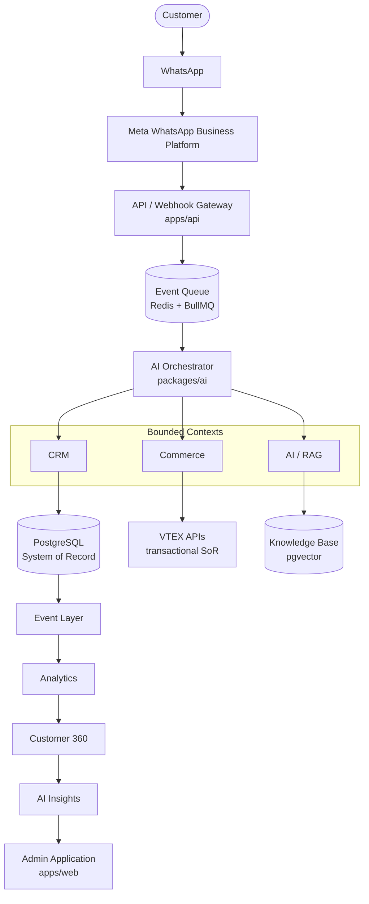

# System Overview — Polar AI Commerce

## 1. What this platform is

Polar AI Commerce is a proprietary **Customer Data + AI + Conversational Commerce platform**. It is not a
chatbot bolted onto a database. It is the system that will, over time, become Polar's System of Record for
customer identity, relationship, consent, and conversational history — starting with WhatsApp as the first
channel, architected so it is never the only one.

The platform combines, as bounded contexts inside one modular monolith:

- **CRM** — customer identity, profile, sport profile, preferences, segments, timeline.
- **Conversation** — conversations, messages, intent, state, summaries.
- **AI** — agents, agent executions, tool calls, prompt/model versioning, recommendations, feedback.
- **Commerce** — cart/checkout/order *references* that mirror VTEX, never replace it.
- **Knowledge** — versioned documents, embeddings, RAG retrieval.
- **Campaign** — segment-driven WhatsApp campaigns, gated by consent.
- **Consent** — LGPD consent, purpose, history, revocation.
- **Analytics** — event stream, funnels, AI/commerce/service metrics.
- **Security** — audit log, RBAC, access boundaries.

## 2. Non-negotiable principles (see full rationale in `CLAUDE.md`)

1. **Data ownership** — Polar's PostgreSQL database is the System of Record for customer identity, consent,
   profile, preferences, and conversation history. Not Meta, not any external CRM/marketing SaaS.
2. **VTEX stays the transactional System of Record.** Catalog, price, stock, cart, checkout, payment, order
   status live in VTEX. The CRM stores *references and snapshots* for relationship/analytics — never a
   competing "second order system."
3. **Claude is not a System of Record.** It never decides price, stock, discounts, policy, consent, or
   identity. It calls typed, authorized tools; the backend enforces every rule.
4. **AI-first, deterministic where it matters.** Language understanding, classification, recommendation
   explanation, summarization → AI. Rules, authorization, pricing, stock, discounts, consent, security →
   deterministic backend code (`packages/security`, business rule engine in `packages/commerce` /
   `packages/crm`).
5. **Privacy by design.** LGPD minimization, purpose limitation, consent-gating, retention policy, audit —
   built in from Phase 0, not retrofitted. PII is never sent to the model beyond what a specific tool call
   needs.

## 3. High-level architecture



## 4. Message-to-response flow (mandatory path)

WhatsApp is **never** connected directly to Claude. Every inbound message flows through:

```text
MESSAGE → IDENTITY → CUSTOMER CONTEXT → CONVERSATION CONTEXT → INTENT →
POLICY CHECK → TOOL SELECTION → CLAUDE → TOOL EXECUTION →
RESULT VALIDATION → RESPONSE GENERATION → SAFETY CHECK → WHATSAPP
```

The webhook handler acknowledges Meta immediately (sub-second) and hands the event to the queue; all
downstream processing (identity resolution, AI orchestration, tool execution) happens asynchronously. This
keeps webhook ack latency independent of AI/VTEX latency and gives us retry/backoff/DLQ semantics for free.

## 5. Deployment shape

Modular monolith today (`apps/api` hosts CRM, Conversation, AI orchestration, Commerce adapters, Consent,
Security as in-process modules behind clean package boundaries), explicitly designed for future extraction
into independent services if/when a bounded context's scale or team ownership justifies it. See
[ADR-0002](adr/ADR-0002-modular-monolith.md).

## 6. Related documents

- [Domain Model](domain-model.md)
- [Data Architecture](data-architecture.md) / [Data Model & ERD](../data/data-model.md)
- [AI Architecture](ai-architecture.md) / [AI Governance](../ai/ai-governance.md)
- [Integration Architecture](integration-architecture.md) ([WhatsApp](../whatsapp/whatsapp-architecture.md),
  [VTEX](../vtex/vtex-architecture.md))
- [Security Architecture](../security/security-architecture.md)
- [Event Model](event-model.md)
- [Repository Structure](repository-structure.md)
- [Environment Strategy](environment-strategy.md)
- [Observability Strategy](observability-strategy.md)
- [ADRs](adr/)
- [Development Roadmap](roadmap.md)
