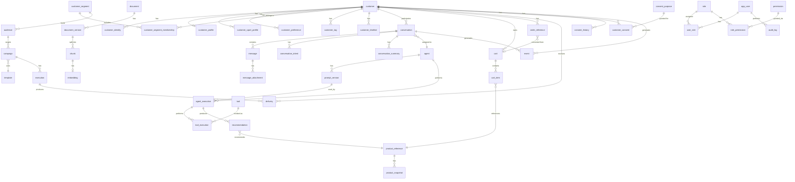

# Data Model & ERD — Polar AI Commerce

Source of truth for the executable schema: [`database/migrations/0001_init.sql`](../../database/migrations/0001_init.sql).
This document is the human-readable catalog; if the two ever disagree, the migration wins and this file
needs updating.

## Conventions

See [Data Architecture](../architecture/data-architecture.md) §3 for baseline conventions (UUID PKs,
`created_at`/`updated_at`, soft delete policy, FK/index discipline). Not repeated per-table below.

## Schema: `crm`

| Table | Purpose | Key constraints |
|---|---|---|
| `customer` | Immutable internal identity anchor | `merged_into_customer_id` self-FK for auditable merges |
| `customer_identity` | External identifiers (WhatsApp, phone, email, VTEX ID) bound to a customer | `unique(identity_type, identity_value)` — one identity can't silently belong to two customers |
| `customer_profile` | Name, birth date, location | `unique(customer_id)` — 1:1 |
| `customer_sport_profile` | Sport, level, frequency, goal, experience | `unique(customer_id, sport)`, `source`+`confidence` for AI-inferred rows |
| `customer_preference` | Structured attribute/value preferences | `unique(customer_id, attribute) where is_current` — history preserved via `is_current` flag, not overwrite; FKs to the conversation/message that produced an inferred preference |
| `customer_segment` | Segment definitions (rule-based via `definition jsonb`, or manual) | `unique(key)` |
| `customer_segment_membership` | Customer↔segment, time-bounded | `unique(customer_id, segment_id) where removed_at is null` |
| `customer_tag` | Free-form tags | `unique(customer_id, tag)` |
| `customer_timeline` | Append-only unified timeline (read model) | indexed `(customer_id, occurred_at desc)` |

## Schema: `conversation`

| Table | Purpose | Key constraints |
|---|---|---|
| `conversation` | One WhatsApp thread; explicit state machine | `status` CHECK enum: `NEW…RESOLVED, ESCALATED, FAILED, BLOCKED` |
| `message` | Every inbound/outbound message | `unique(provider_message_id)` — the idempotency key for Meta webhook replays |
| `message_attachment` | Media attached to a message | FK cascade from `message` |
| `conversation_intent` | Classified intent per turn | `confidence` CHECK 0–1, `source` in `ai/rules/human` |
| `conversation_summary` | Rolling, versioned summary | used to bound AI context (see AI Architecture) |

## Schema: `ai`

| Table | Purpose | Key constraints |
|---|---|---|
| `agent` | Declarative agent definition + allowed tool list | `unique(key)` |
| `prompt_version` | Immutable versioned prompt text | `unique(agent_id, version)`; never edited in place (ADR-0009) |
| `agent_execution` | One orchestrator run — the audit unit | FKs to agent, prompt_version, conversation, customer; tokens/latency/status |
| `tool` | Typed tool catalog | `input_schema`/`output_schema` as JSON Schema in `jsonb` |
| `tool_execution` | Per-call log: input, output, status, latency | `status` includes `denied` (authorization failures are first-class, not exceptions) |
| `recommendation` | Product recommended to a customer + outcome | FK to `commerce.product_reference` |
| `ai_feedback` | Explicit/implicit feedback on an execution or recommendation | — |

## Schema: `commerce`

| Table | Purpose | Key constraints |
|---|---|---|
| `product_reference` | Local pointer to a VTEX SKU | `unique(vtex_sku_id)` |
| `product_snapshot` | Point-in-time price/stock snapshot | `source` default `'VTEX'`, `fetched_at` — never treated as current without a freshness check |
| `cart` | CRM-side cart tracking | `unique(vtex_cart_id)` — prevents accidental double-cart creation |
| `cart_item` | Cart line items | `quantity > 0` |
| `order_reference` | Minimal order data for timeline/analytics | `unique(vtex_order_id)` |

## Schema: `knowledge`

| Table | Purpose | Key constraints |
|---|---|---|
| `source` | Where a document originated | — |
| `document` | Logical document | — |
| `document_version` | Versioned content with lifecycle | `status` CHECK `DRAFT/REVIEW/PUBLISHED/ARCHIVED`; **only `PUBLISHED` is retrievable by RAG** |
| `chunk` | Chunked content per version | `unique(document_version_id, chunk_index)` |
| `embedding` | pgvector embedding per chunk | `vector(1536)` (dimension pinned to the embedding model in use; revisit via migration if the model changes) |

## Schema: `campaign`

| Table | Purpose | Key constraints |
|---|---|---|
| `audience` | Segment or ad-hoc definition | FK to `crm.customer_segment` |
| `template` | WhatsApp template metadata | `status` tracks Meta approval state |
| `campaign` | Campaign definition | FK to audience + template |
| `execution` | One send run of a campaign | — |
| `delivery` | Per-customer delivery outcome | `unique(execution_id, customer_id)`; `status` includes `opted_out` |

## Schema: `consent`

| Table | Purpose | Key constraints |
|---|---|---|
| `consent_purpose` | Purpose catalog (marketing, transactional, ai_processing, analytics) | `unique(key)` |
| `customer_consent` | **Current** state per customer/purpose | `unique(customer_id, purpose_id)` |
| `consent_history` | Append-only history of every grant/revoke | never updated/deleted |

## Schema: `analytics`

| Table/View | Purpose | Key constraints |
|---|---|---|
| `event` | Canonical append-only event log | `unique(dedupe_key)` — idempotency; see [Event Model](../architecture/event-model.md) |
| `customer_event` (view) | Events with a `customer_id` | Implemented as a view over `event`, not a physical table — avoids dual-write drift (ADR-0010) |
| `commerce_event` (view) | Cart/checkout/order events | Same rationale |

## Schema: `security`

| Table | Purpose | Key constraints |
|---|---|---|
| `role`, `permission`, `role_permission` | RBAC catalog | see Security Architecture §RBAC |
| `app_user` | Admin application users | `unique(email)` |
| `user_role` | User↔role assignment | composite PK |
| `audit_log` | Immutable administrative action log | indexed on `(entity_type, entity_id)` and `occurred_at` |

## Full ERD

## Notable deviations from a literal reading of the master prompt's table list

- `analytics.customer_event` and `analytics.commerce_event` are **views**, not physical tables, over
  `analytics.event`. A single append-only write path is safer than three tables that could drift out of
  sync. See ADR-0010.
- `security` gained `role`, `permission`, `role_permission`, `app_user`, `user_role` beyond the single
  `audit_log` the master prompt lists explicitly — required to implement RBAC (master prompt §38) and admin
  authentication (§73 step 6). These are additive, not a deviation from intent.
